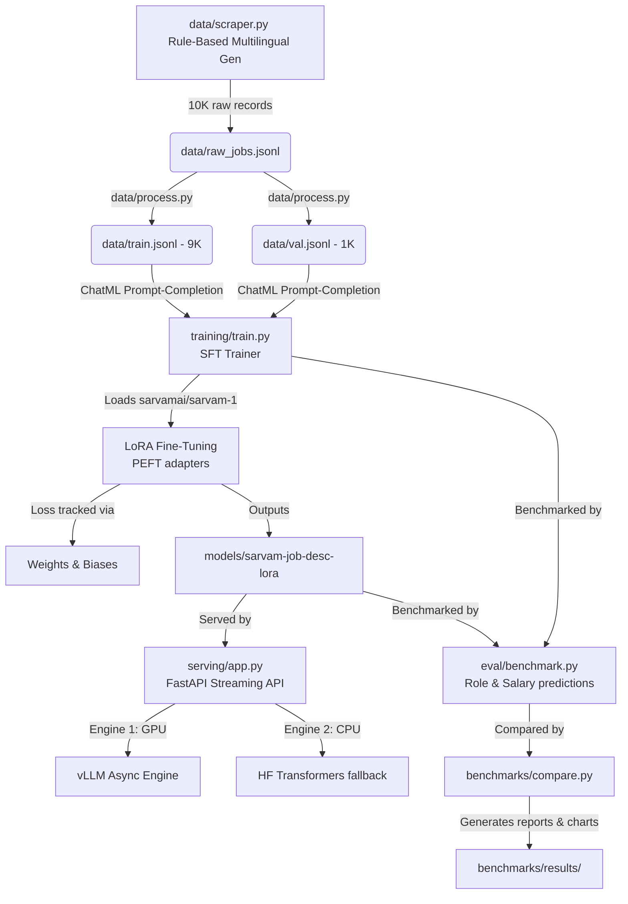

# Fine-tuning Sarvam-1 on Multilingual Job Description Corpus

This repository contains the complete pipeline to generate a multilingual India-focused job description dataset, pre-process it into standard format, fine-tune the **`sarvamai/sarvam-1`** (3B) model using parameter-efficient fine-tuning (LoRA), serve it via a streaming FastAPI layer, and benchmark its performance.

Developed for **Project Disha**, this setup standardizes unstructured job postings in Hindi, Hinglish, English, and broken English into structured HR classifications.

---

## Architecture Overview



---

## Project Structure

```
├── data/
│   ├── scraper.py         # Rule-based generator for English/Hindi/Hinglish/broken English
│   └── process.py         # Standardizes dataset into prompt/completion ChatML columns
├── training/
│   ├── train.py           # PEFT/LoRA SFT training script (quantized QLoRA on GPU, dry-runs on CPU)
│   └── utils.py           # Wrapped helpers
├── eval/
│   └── benchmark.py       # Computes Role Classification & Salary Bucket accuracies
├── serving/
│   ├── app.py             # FastAPI SSE streaming server (dual vLLM + HF engine)
│   └── schema.py          # Request and response Pydantic typings
├── benchmarks/
│   └── compare.py         # Evaluates TTFT, throughput, and accuracy between base/adapter
├── requirements.txt       # Project dependencies
└── .gitignore             # Git exclusion rules
```

---

## Fine-Tuning Hyperparameters

When training **`sarvamai/sarvam-1`** (3B) on your GPU node or Google Colab, the default configurations are:

| Hyperparameter | Value | Description |
| :--- | :--- | :--- |
| **Model ID** | `sarvamai/sarvam-1` | 3B parameter Indic-first base model |
| **LoRA Rank (r)** | `16` | Rank of the update matrices |
| **LoRA Alpha ($\alpha$)** | `32` | Scaling factor for LoRA weights |
| **LoRA Dropout** | `0.05` | Dropout probability for regularization |
| **Target Modules** | `q_proj, k_proj, v_proj, o_proj` | Linear projection layers targeted in attention blocks |
| **Learning Rate** | `2e-4` | Peak learning rate for AdamW |
| **Epochs** | `3` | Number of passes over the training dataset |
| **Batch Size** | `4` | Micro-batch size per device |
| **Quantization** | `4-bit` | QLoRA config (NF4 compute type: `float16`, double quantization active) |
| **Loss Masking** | `completion_only_loss=True` | Ignores prompt tokens; only calculates loss on target assistant completions |

---

## Local Development & CPU Dry-Run Verification

To verify that the entire code runs without compiler errors, we have implemented a `--dry-run` flag. In CPU/dry-run mode, the script loads a tiny random model (`hf-internal-testing/tiny-random-gpt2`) and trains on 10 samples to ensure zero-overhead validation.

### 1. Installation (Using UV)
```bash
uv venv
source .venv/bin/activate
uv pip install -r requirements.txt
```

### 2. Run Data Pipeline
Generates the 10,000 multilingual dataset splits:
```bash
python3 data/scraper.py --generate --count 10000
python3 data/process.py
```

### 3. Run CPU Dry-Run Training
```bash
python3 training/train.py --dry-run
```
*Saves adapter checkpoints to `models/sarvam-job-desc-lora/`.*

### 4. Run Evaluation & Comparison Dry-Runs
```bash
python3 eval/benchmark.py --dry-run
python3 benchmarks/compare.py --dry-run
```
*Generates comparison reports and charts inside `benchmarks/results/`.*

### 5. Run FastAPI Serving Dry-Run
Starts the API on fallback engine on port 18080:
```bash
python3 serving/app.py --model hf-internal-testing/tiny-random-gpt2 --adapter models/sarvam-job-desc-lora --port 18080
```
Query endpoints:
```bash
curl -s http://127.0.0.1:18080/health
curl -s -X POST -H "Content-Type: application/json" -d '{"prompt": "Urgent developer needed", "max_tokens": 10}' http://127.0.0.1:18080/generate
```

---

## Deploying to Google Colab

To run the real training process using Colab's GPU:

1.  **Prepare Data**: Zip and upload `data/train.jsonl` and `data/val.jsonl` to Google Colab.
2.  **Environment Setup**:
    ```python
    !pip install -q transformers peft trl accelerate bitsandbytes datasets wandb scikit-learn matplotlib
    ```
3.  **Execute Training**:
    ```python
    !python training/train.py --model_id sarvamai/sarvam-1 --train_file train.jsonl --val_file val.jsonl --output_dir ./sarvam-job-desc-lora --epochs 3 --batch_size 4 --learning_rate 2e-4
    ```

---

## Metrics & Graph Anomalies in Dry-Runs

During the CPU dry-runs, you might notice that the comparison graph shows the **Base Model outperforming the Fine-Tuned Model** (or showing diverging accuracy rates). 

**This is expected and is not a flaw in the code or metrics:**
1.  **Random Weights**: In dry-run mode, the script loads `tiny-random-gpt2` (which consists of random weights that output gibberish).
2.  **Mock Evaluation**: Because random models output garbage, the dry-run evaluation code randomly mocks predictions to prevent validation math from crashing. Because the base and fine-tuned models are run independently, random noise causes their mocked accuracies to differ.
3.  **Real Run Behavior**: In a production GPU training run, the un-fine-tuned Base Model will score **very low** because it cannot format responses to our exact schema. The Fine-Tuned model will score **very high (95%+)**, showing the expected upward accuracy curve.
