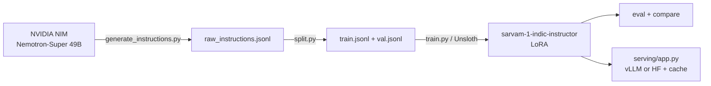

# Indic Instructor

Fine-tune **[Sarvam-1](https://huggingface.co/sarvamai/sarvam-1)** (2B) so it follows instructions in **Hinglish**, **Hindi (Devanagari)**, and **English**.


## Docs

| Doc | Purpose |
|-----|---------|
| **[docs/STATUS.md](./docs/STATUS.md)** | Handoff status |
| [docs/setup.md](./docs/setup.md) | Setup |
| [AGENTS.md](./AGENTS.md) | Agent guidance |

| | |
|--|--|
| **Teacher data** | [NVIDIA Nemotron-Super 49B](https://build.nvidia.com/) via NIM (OpenAI-compatible API) |
| **Training** | Unsloth 4-bit + LoRA SFT |
| **Serving** | FastAPI · vLLM (GPU) or Hugging Face (fallback) · in-memory response cache |
| **Eval** | BLEU-1 · ROUGE-L · latency / throughput |

This repo is **only** for data generation, training, evaluation, and inference. No product apps beyond the model API.

## Current status

| Step | State |
|------|--------|
| Synthetic data generator | Ready (`make generate`, supports `--resume`) |
| Sample data on disk | Partial (~hundreds of pairs; target 15k) |
| Train / val split | Run `make split` after generation |
| Real Sarvam-1 LoRA on GPU | Not checked in yet — train on Colab or local CUDA |
| CPU dry-run path | Works (`make train-dry`, `make eval-dry`) |
| Serving + cache | Ready (`make serve`) |

Teacher bake-off (see git history): **Nemotron-Super 49B** quality beat smaller / slower alternatives for multilingual instruction pairs.

## Languages

| Language | Script | Generator label |
|----------|--------|-----------------|
| Hinglish | Roman | `hinglish` |
| Hindi | Devanagari | `hi` |
| English | Latin | `en` |

Tasks in the generator mix: translation, summarization, QA, brainstorming, classification, creative writing, grammar.

## Pipeline


```mermaid
flowchart LR
    A[NVIDIA NIM<br/>Nemotron-Super 49B] -->|generate_instructions.py| B[raw_instructions.jsonl]
    B -->|split.py| C[train.jsonl + val.jsonl]
    C -->|train.py / Unsloth| D[sarvam-1-indic-instructor<br/>LoRA]
    D --> E[eval + compare]
    D --> F[serving/app.py<br/>vLLM or HF + cache]
```

## Quick start

```bash
# Prerequisites: Python 3.10+, CUDA optional (needed for real training)

cp .env.example .env
# Set NVIDIA_API_KEY=... from https://build.nvidia.com/nim

make generate    # default: 15k pairs (long; use --count / --resume on the script)
make split
make train-dry   # smoke test without GPU
make eval-dry
```

Full GPU train (local):

```bash
make train
# writes models/sarvam-1-indic-instructor/
```

### Colab

```python
!git clone https://github.com/anmolsharma152/sarvam-1-indic-instructor
%cd sarvam-1-indic-instructor
!bash setup/colab_setup.sh
!python training/train.py
```

Delete `unsloth_compiled_cache/` between Colab runs if you hit Unsloth pickle errors.

## Commands

| Command | Description |
|---------|-------------|
| `make generate` | Generate instruction JSONL (15k default) |
| `make split` | 90/10 → `data/train.jsonl`, `data/val.jsonl` |
| `make train-dry` | CPU dry-run (tiny GPT-2) |
| `make train` | Full Unsloth LoRA on CUDA |
| `make train-colab` | Explicit Colab-friendly flags |
| `make eval-dry` / `make eval` | Quality + latency on val samples |
| `make compare-dry` / `make compare` | Base vs fine-tuned charts under `benchmarks/results/` |
| `make serve` | Inference API on `127.0.0.1:8000` |
| `make clean` | Drop generated data, models, logs, caches |

Override paths:

```bash
make train ADAPTER=models/my-run
make serve MODEL=sarvamai/sarvam-1 ADAPTER=models/sarvam-1-indic-instructor
```

## Serving

```bash
make serve

# or
cd serving && python app.py \
  --model sarvamai/sarvam-1 \
  --adapter ../models/sarvam-1-indic-instructor \
  --cache_size 256 \
  --host 127.0.0.1 --port 8000
```

| Method | Path | Notes |
|--------|------|--------|
| `POST` | `/generate` | Full completion; **LRU-cached** by prompt + sampling params |
| `POST` | `/stream` | SSE tokens; not cached |
| `GET` | `/health` | Engine, device, cache hit/miss stats |
| `POST` | `/cache/clear` | Flush cache |

- **vLLM** is used when CUDA + vLLM are available and **no** LoRA adapter path is set (use a **merged** 16-bit export for vLLM).
- **HF + PEFT** is used when `--adapter` points at a LoRA directory, or on CPU / with `--force_hf`.

Train also exports `models/sarvam-1-indic-instructor-merged-16bit/` when Unsloth runs on GPU.

Example request:

```bash
curl -s http://127.0.0.1:8000/generate \
  -H 'Content-Type: application/json' \
  -d '{"prompt":"2+2 kya hai?","max_tokens":64,"temperature":0.2}'
```

## Evaluation metrics

After a real train + val set:

```bash
make eval
make compare
```

| Metric | Meaning |
|--------|---------|
| BLEU-1 | Unigram overlap vs reference (simple smoke metric) |
| ROUGE-L | LCS-based F1 vs reference |
| Latency / tok/s / TTFT | Serving cost |

Fill real base vs fine-tuned numbers into your notes from `eval/results.json` and `benchmarks/results/` — do not invent scores.

## Repository layout

```text
data/                 # generate_instructions.py, split.py, JSONL
training/             # Unsloth SFT (train.py), ChatML utils
eval/                 # benchmark.py
benchmarks/           # compare.py → results/
serving/              # FastAPI app + schemas
setup/colab_setup.sh  # Colab install
docs/                 # scope + Unsloth training notes
Makefile              # generate / train / eval / serve
run_pipeline.sh       # generate + split
```

## Stack details

- **LoRA:** `r=16`, `alpha=32`; Unsloth targets `q/k/v/o` + `gate/up/down_proj`
- **Chat template:** ChatML (`<|im_start|>user/assistant`)
- **Tracking:** Weights & Biases (offline if `WANDB_API_KEY` unset)
- **Secrets:** `.env` with `NVIDIA_API_KEY` (see `.env.example`)

## License / model card

Base weights: [sarvamai/sarvam-1](https://huggingface.co/sarvamai/sarvam-1) — respect Sarvam’s license when redistributing adapters or merges.
